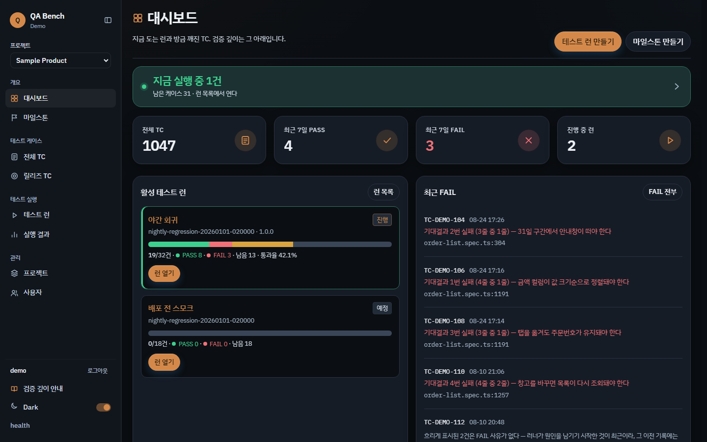
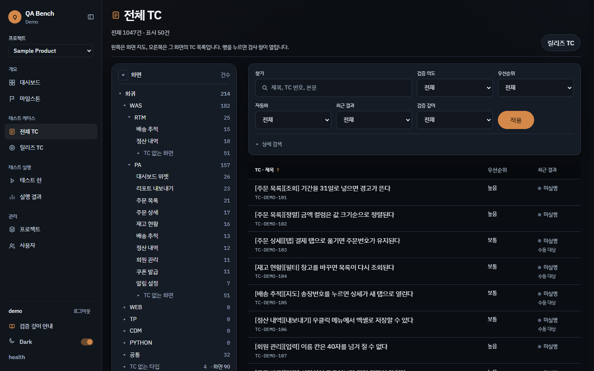
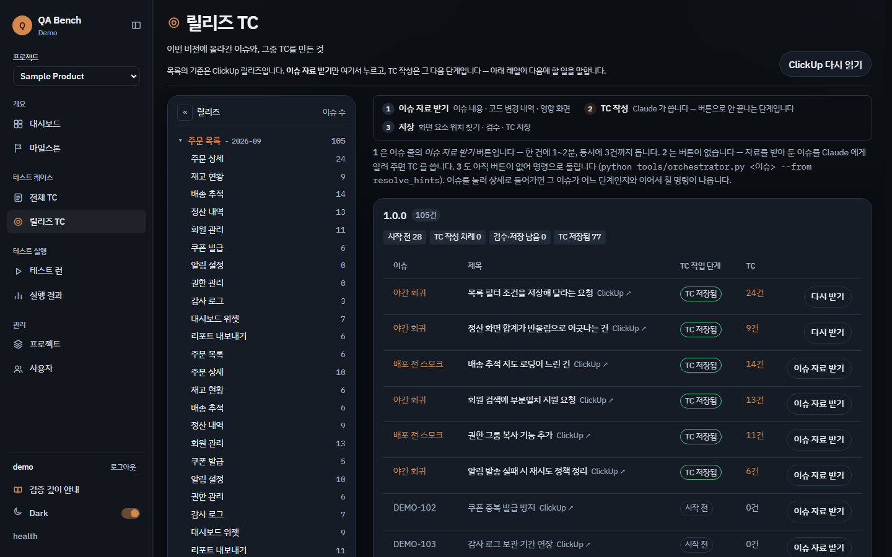

# qa-tc-studio

**소스 기반 테스트케이스 → 인터랙티브 HTML 리포트 & 공유 대시보드.**

제품 소스/명세/실제 화면을 대조해 만든 테스트케이스(TC)를 하나의 JSON(`tc_data.json`)으로 관리하고, 이를 **클릭해서 Pass/Fail·비고를 기록하는 인터랙티브 리포트**와 **팀 공유 대시보드**로 렌더링합니다. AI로 초안을 만들고 QA가 검증하는 워크플로를 위한 도구입니다.

> 철학: **"AI는 초안 생성, QA는 검증·판단."** 자세한 원칙은 [METHODOLOGY.md](METHODOLOGY.md).

파이썬 **기본 모듈만** 사용합니다. 외부 패키지 설치 불필요 (Python 3.8+).

---

## 특징

- 📄 **단일 정본**: 모든 TC를 `tc_data.json` 하나로 관리 ([스키마](schema/tc_data.schema.json))
- 🖱️ **인터랙티브 리포트**: 각 TC를 클릭해 Pass/Fail/N·T·비고 기록 → 자동 저장(localStorage)
- 🤖 **검증방법 추적**: TC별 자동(Playwright)/수동 확인을 구분 표시 + 필터·집계 (결과와 독립된 축)
- 👥 **공유 대시보드**: `serve_dashboard.py`로 띄우면 결과가 서버에 저장돼 여러 명이 공유
- 🧭 **대메뉴 > 카테고리 > 화면 > 섹션** 구조, 진행율·집계·자동화 커버리지·위험/확신 분포
- 🏷️ **자동 태깅**: 설계기법·위험도·확신도·자동화 가능여부를 규칙으로 부여 (QA가 검토·수정)
- 🗺️ **설계맵**: 확신도 히트맵·기능 분류 트리·Gap 분석·탐색 테스트 차터
- ✅ **자체 검증**: `validate_tc.py` (AI 자가채점이 아니라 스크립트가 검증, CI 연동 가능)
- 🚶 **단독 재현**: 각 절차 맨 앞에 "…화면으로 이동" 단계 자동 삽입
- 📤 **CSV 내보내기/불러오기** 로 결과 백업·공유
- 🧪 **확장 프로토타입**: 테스트 런·실행 검수·릴리즈 추적 UI ([QA Bench](#확장-프로토타입--qa-bench))

---

## 빠른 시작

```bash
# 1) 예제로 리포트 생성
python scripts/render_report.py examples/tc_data.example.json -o out

# 2) out/report.html 을 브라우저로 열기 (단독 사용, 결과는 브라우저에 저장)

# 3) 팀 공유 대시보드 (결과를 서버에 저장)
python scripts/render_report.py examples/tc_data.example.json -o out
python scripts/serve_dashboard.py 8787 out/dashboard.html
#   → http://localhost:8787  (같은 네트워크의 다른 PC는 http://<이 PC IP>:8787)

# 4) 데이터 검증 (CI에서 error 시 exit 1)
python scripts/validate_tc.py examples/tc_data.example.json
```

---

## 내 제품에 적용하기

1. `examples/tc_data.example.json`을 복사해 `tc_data.json`을 만든다.
2. [METHODOLOGY.md](METHODOLOGY.md)에 따라 소스/명세/화면을 대조하며 TC를 채운다.
   - `risk`·`confidence`·`techniques`·`automation`은 **생략 가능** → 규칙이 자동 태깅. 필요 시 직접 지정해 덮어쓴다.
3. `python scripts/validate_tc.py tc_data.json` 로 검증.
4. `python scripts/render_report.py tc_data.json -o out` 로 리포트 생성.

### AI에게 초안을 맡기려면

- **Codex**: 아래 GitHub 경로를 설치하면 됩니다.

```text
Install the Codex skill from https://github.com/tempesty-ai/qa-tc-studio/tree/main/skills/qa-tc-studio
```

- **Claude**: GitHub Release에서 `qa-tc-studio.zip`을 내려받아 custom skill로 업로드합니다.

```text
https://github.com/tempesty-ai/qa-tc-studio/releases/latest/download/qa-tc-studio.zip
```

자세한 설치 방법은 [docs/installation.md](docs/installation.md)에 정리되어 있습니다.

두 경우 모두 산출물은 이 저장소의 `tc_data.json` 스키마를 따르며, 위 스크립트로 렌더링합니다.

---

## tc_data.json 구조 (요약)

```jsonc
{
  "title": "제품명 — 테스트케이스 리포트",
  "id_prefix": "SMP",
  "auto_nav": true,
  "menus": [{
    "name": "회원 관리", "code": "USR",
    "groups": [{
      "name": "계정", "code": "ACC",
      "screens": [{
        "name": "회원 목록", "code": "LIST",
        "cases": [{
          "section": "목록",
          "func": "정상 등록",
          "precondition": "관리자로 로그인되어 있다.",
          "process": "1. 이름을 입력한다.\n2. [저장] 버튼을 클릭한다.",
          "expected": "'저장되었습니다' 메시지가 표시된다."
          // risk/confidence/techniques/automation 생략 시 자동 태깅
        }]
      }]
    }]
  }]
}
```

전체 필드는 [schema/tc_data.schema.json](schema/tc_data.schema.json) 참조.

---

---

## 확장 프로토타입 — QA Bench

`qa-tc-studio`는 **TC 정본 관리 → 리포트·대시보드**까지를 다룹니다. 그 위에 얹히는
**테스트 런 · 실행 검수 · 릴리즈 추적** 층을 UI로 먼저 설계해 본 프로토타입이 `demo/qa-bench/` 입니다.
서버 없이 `demo/qa-bench/index.html` 을 브라우저로 열면 바로 확인할 수 있습니다.

### 대시보드 — 지금 도는 런과 방금 깨진 TC



전체 TC 수가 아니라 **지금 실행 중인 런, 최근 7일 PASS/FAIL, 방금 깨진 TC**를 먼저 보여줍니다.
진행률 막대는 PASS · FAIL · 남음을 한 줄에 겹쳐 표시해, 통과율만으로는 안 보이는
"얼마나 남았는지"가 같이 읽히도록 했습니다.

### 전체 TC — 화면 지도 + 검증 축 필터



왼쪽은 **화면 지도**(대메뉴 → 카테고리 → 화면), 오른쪽은 그 화면의 TC 목록입니다.
`TC 없는 화면` 을 따로 세어 **비어 있는 곳을 숨기지 않습니다.**
필터 축은 결과와 분리돼 있습니다 — 검증 의도 · 우선순위 · 자동화 여부 · 최근 결과 · **검증 깊이**.

### 릴리즈 TC — 버전에 묶인 이슈와 TC



특정 버전에 포함된 이슈와 거기 연결된 TC를 함께 봅니다. 이슈마다 `TC 저장됨` / 미작성 상태가
드러나므로, **릴리즈에 들어가는데 TC가 없는 항목**이 눈에 띕니다.

### 설계에서 잡은 원칙

- **진척은 TC 개수가 아니라 검증 깊이로.** 전수 검증 · 부분 검증 · 미검수 · 검수 막힘을
  구분해, "몇 건 실행했다"가 "얼마나 확인됐다"를 대신하지 않게 했습니다.
- **화면의 껍데기가 데이터보다 눈에 띄지 않게.** 색은 상태 구분에만 쓰고 장식에는 쓰지 않습니다.
- 데모 데이터는 전부 가상입니다. 실제 이슈 트래커 링크는 포함하지 않습니다.

> 이 프로토타입은 원래 별도 저장소(`testoperation`)였습니다. 다루는 대상이 같은 TC 라이프사이클이라
> 이곳으로 옮겼습니다. 현재는 정적 UI이며, `qa-tc-studio` 의 데이터 모델과는 아직 연결돼 있지 않습니다.

## 폴더 구조

```
qa-tc-studio/
├─ README.md
├─ METHODOLOGY.md            방법론(설계 원칙)
├─ scripts/
│  ├─ render_report.py       tc_data.json → report.html + dashboard.html
│  ├─ serve_dashboard.py     공유 대시보드 서버(기본 모듈만, 포트 8787)
│  └─ validate_tc.py         자체 검증(중복 ID/공란/형식) — CI 연동
├─ schema/tc_data.schema.json
├─ examples/tc_data.example.json
├─ skills/qa-tc-studio/      Codex/Claude 공용 설치형 Skill
├─ demo/qa-bench/           확장 프로토타입 UI (정적, 서버 불필요)
├─ docs/screens/            README 용 화면 캡처
├─ claude/SKILL.md           이전 Claude 지침
├─ codex/AGENTS.md           이전 Codex/기타 에이전트 지침
└─ docs/installation.md      Codex/Claude 설치 가이드
```

---

## 안전 · 범위

- 자동화 대상은 **개발/테스트 환경 한정** (운영 금지).
- 자동화 생성 데이터는 접두어 + 정리(afterEach) 원칙.
- 파괴적/실발송/장시간 잡은 분리(`@destructive`) 또는 수동. 자세한 내용은 METHODOLOGY §10.

## 라이선스

MIT
